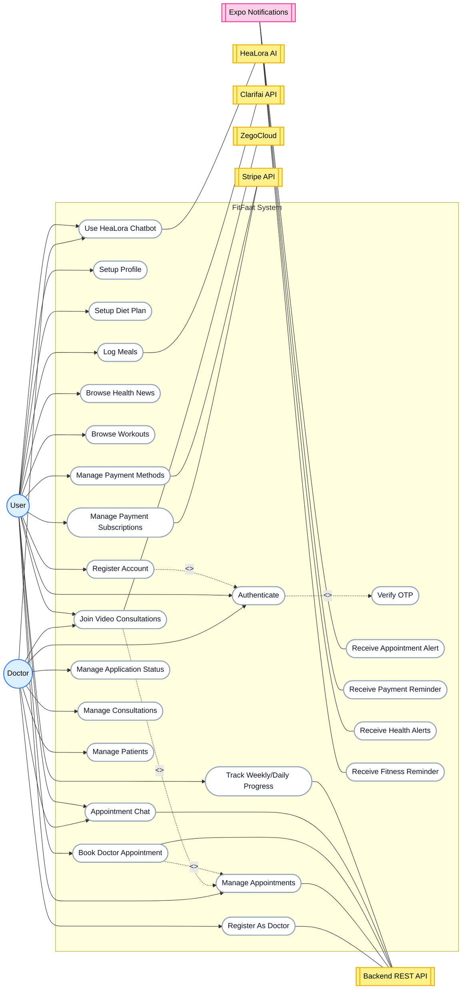
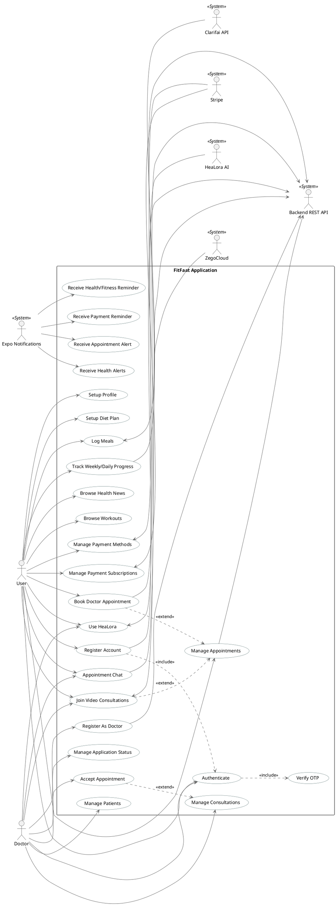

# FitFaat Use Case Diagram

This document contains the fixed use case diagram updated to accurately reflect FitFaat's codebase logic.

## Summary of Fixes:
1. **Added Clarifai API Actor:** Incorporated `Clarifai API` for the `Log Meals` use case, as image food detection relies on this service instead of HeaLora.
2. **Removed Duplicate Nodes:** The original diagram incorrectly showed duplicate use cases (like `Manage Appointments`, `Track Weekly/Daily Progress`, `Appointment Chat`). These have been unified to standard UML.
3. **Corrected Doctor Progress Tracking:** Removed the incorrect link between `Doctor` and `Track Weekly/Daily Progress` since progress tracking applies to the User.
4. **Refined Video Consultation and Chat Links:** Both User and Doctor can connect to `Appointment Chat` and `Join Video Consultations` (powered by `ZegoCloud`).
5. **Consolidated Extends/Includes:** Fixed the `<<include>>` arrows pointing from `Register Account` -> `Authenticate` -> `Verify OTP`.

---

## Mermaid Diagram

---

## PlantUML Source
If you prefer traditional UML visualization, here is the `.puml` code:

